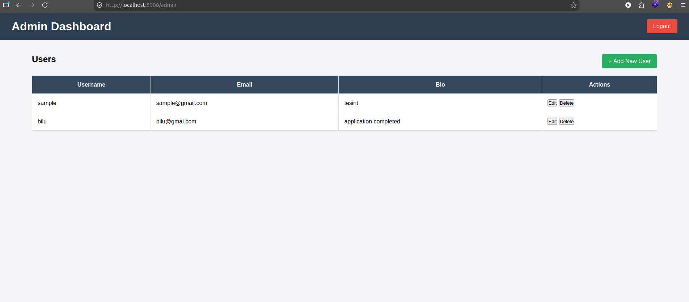
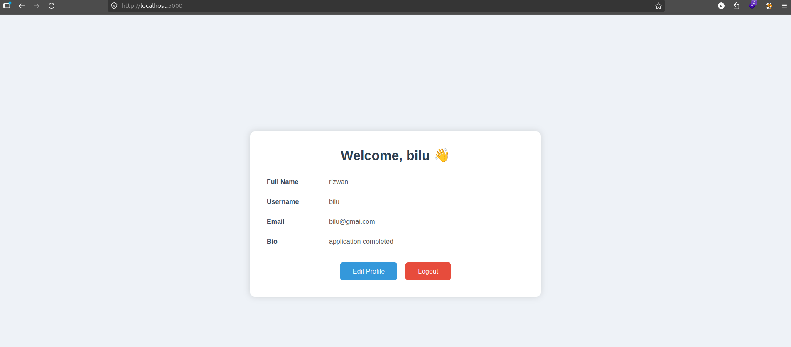

# **Document of Vulnerable RESTfull API in Flask**
# 🔐 Flask API Security Lab

A simple vulnerable Flask application built for learning **API Development**, **JWT Authentication**, and **API Penetration Testing**.

This lab is designed for students and beginners who want to practice discovering and exploiting common API security vulnerabilities in a safe environment.

---

## 🚀 Features

### 👨‍💼 Admin

- Admin Login
- JWT Authentication
- Create User
- View Users
- Update User
- Delete User

### 👤 User

- User Login
- JWT Authentication
- User Dashboard
- Update Profile
- Logout


---

## 🛠️ Technologies Used

- Python
- Flask
- SQLite3
- HTML
- CSS
- JavaScript
- JWT Authentication

---

## 📁 Project Structure

```text
Flask_API/
│
├── app.py
├── admin.db
├── create_database.py
│
├── templates/
│   ├── admin_login.html
│   ├── admin_signup.html
│   ├── admin_home.html
│   ├── create_user.html
│   ├── user_login.html
│   ├── user_dashboard.html
│   └── profile_update.html
│
├── static/
│   ├── css/
│   └── js/
│
└── README.md
```

---

# 🌐 API Endpoints

| Method | Endpoint | Description |
|---------|----------|-------------|
| POST | `/api/login` | User Login |
| POST | `/api/create_user` | Create User |
| GET | `/api/users` | Get All Users |
| PUT | `/api/edit_user/<id>` | Update User |
| DELETE | `/api/users/<id>` | Delete User |

---

# 🎯 Purpose of this Lab

This project is built for learning and practicing:

- Flask Development
- REST API Development
- JWT Authentication
- API Security
- Web Application Penetration Testing
- OWASP API Security Top 10

The application intentionally contains insecure designs and weak implementations to provide a practical environment for security testing.

---

# 🔍 OWASP API Security Vulnerabilities Present

- API1:2023 - Broken Object Level Authorization (BOLA)
- API2:2023 - Broken Authentication
- API3:2023 - Broken Object Property Level Authorization
- API4:2023 - Unrestricted Resource Consumption
- API5:2023 - Broken Function Level Authorization
- API8:2023 - Security Misconfiguration

---

# 🧪 Pentesting Practice

This lab allows you to practice:

- API Discovery
- JWT Testing
- Authentication Testing
- Authorization Testing
- IDOR Testing
- CRUD API Testing
- SQL Injection Testing
- HTTP Method Testing
- Session Testing
- Parameter Manipulation
- Business Logic Testing

---

# ⚠️ Weak Designs in this Lab

- Plain Text Password Storage
- Weak JWT Secret Key
- Missing Rate Limiting
- Missing Role-Based Authorization
- Missing Input Validation
- Weak Password Policy
- Flask Debug Mode Enabled
- Missing HTTPS
- Missing CSRF Protection
- No Account Lockout
- Missing Security Logging

---

# 🚀 Future Improvements

- Password Hashing (bcrypt)
- Refresh Tokens
- Email Verification
- Password Reset
- Role-Based Access Control (RBAC)
- Audit Logging
- Rate Limiting
- HTTPS
- CSRF Protection
- Security Headers
- Secure Cookie Configuration

---

# 💻 Running the Lab

## 1. Clone the Repository

```bash
git clone https://github.com/your-username/Flask_API_Security_Lab.git

cd Flask_API_Security_Lab
```

---

## 2. Create a Virtual Environment

Linux

```bash
python3 -m venv venv
```

Windows

```bash
python -m venv venv
```

---

## 3. Activate the Virtual Environment

Linux

```bash
source venv/bin/activate
```

Windows

```cmd
venv\Scripts\activate
```

---

## 4. Install Dependencies

```bash
pip install flask flask-jwt-extended
```

or

```bash
pip install -r requirements.txt
```

---

## 5. Create the Database

```bash
python create_database.py
```

---

## 6. Run the Application

```bash
python app.py
```

The application will be available at:

```
http://127.0.0.1:5000
```

---

# 🔐 Default Workflow

```text
Admin Signup
      │
      ▼
Admin Login
      │
      ▼
JWT Cookie Created
      │
      ▼
Admin Dashboard
      │
      ▼
Create User
      │
      ▼
User Login
      │
      ▼
JWT Cookie Created
      │
      ▼
User Dashboard
```

---

# 📚 Recommended Tools

- Burp Suite
- Postman
- FFUF
- Nmap
- Browser Developer Tools
- JWT.io

---

# 🎓 Learning Objectives

After completing this lab, you should understand:

- Flask Routing
- REST API Development
- CRUD Operations
- JWT Authentication
- Session Management
- API Security Testing
- Authorization Testing
- Common API Security Vulnerabilities

---

# 📌 Disclaimer

This project is intentionally designed for **educational purposes only**.

It contains insecure implementations to help students understand API security concepts and practice penetration testing techniques in a controlled environment.

Do **not** deploy this application to a production environment.

---

# ⭐ Support

If you found this lab useful, consider giving the repository a ⭐ on GitHub.

Happy Learning! 🚀
